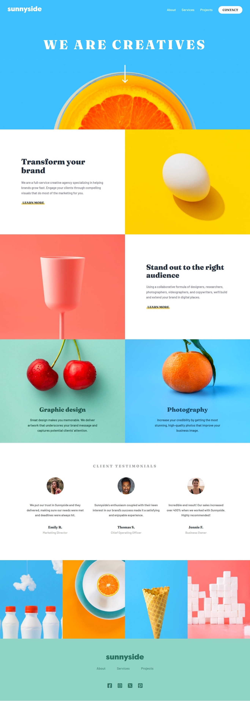

# Frontend Mentor - Sunnyside agency landing page solution

  

This is a solution to the [Chat app CSS illustration challenge on Frontend Mentor](https://www.frontendmentor.io/solutions/sunnyside-agency-landing-page-solution-rpA6XabFmB). Frontend Mentor challenges help us to improve our coding skills by building realistic projects.   

## Built with

- Semantic HTML5 markup
- SCSS
- Flexbox
- CSS Grid
- Javascript
- Mobile-first workflow

Preview it here - [Sunnyside agency](https://agency-sunnyside-landing-page.netlify.app/)   

## Author

- Website - [Black Fury](https://blackfury117.github.io/)
- Frontend Mentor - [@BlackFury117](https://www.frontendmentor.io/profile/BlackFury117)
- Twitter - [@blackfury117](https://www.twitter.com/blackfury117)